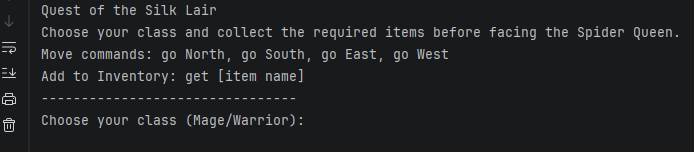

# Python Text Adventure Game
## Game Screenshot



A command-line adventure game where players navigate rooms, collect items, and avoid the villain to win.
This project is a text-based adventure game developed in Python as part of coursework for the Computer Science program at Southern New Hampshire University.

## Features
- Room navigation system
- Item collection
- Win/Lose conditions
- Input-based gameplay

## Game Commands
- go North / go South / go East / go West – move between rooms
- get [item] – pick up an item
- inventory – view collected items

## Project Structure
```text
python-text-adventure-game/
├── TextBasedGame.py          # Main game logic
├── README.md                 # Project documentation
└── gameplay-screenshot.png   # Example gameplay
```

## Learning Objectives
This project demonstrates:

- Python dictionaries for game state
- Control flow and conditional logic
- User input handling
- Game loop structure
- Basic game design principles

## Technologies Used
- Python
- Control structures
- Dictionaries
- Functions

## How to Run

1. Download the file  
2. Run in Python  

```bash
python TextBasedGame.py
```

## Author
Anthony Bowser Jr  
Computer Science Student  
Southern New Hampshire University
